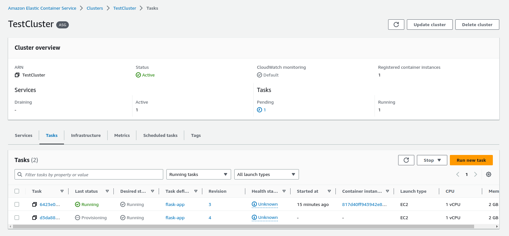

# CHALLENGE MACHINE LEARNING ENGINEER

# Previo
Antes de comenzar a desarrollar la solución al problema planteado, se realiza una estandarización de la estructura del proyecto. Aquí suponemos que esta estructura es conocida por todo el equipo. Al estructurar el proyecto de esta forma se deben hacer algunas modificaciones al notebook entregado, específicamente a las rutas definidas. Por ejemplo, la ruta "dataset_SCL.csv" ahora se indica como a "data/dataset_SCL.csv". A continuación se detalla la estructura del proyecto:

    |----- .github/
            |----- workflows                    <- Define acciones en github
    |----- data/                                <- Contiene la data del proyecto 
            |----- all_features.csv             <- csv con data original y sintética
            |----- dataset_SCL.csv              <- dataset original
            |----- synthetic_features.csv       <- features generados por data scientist
    |----- models/                              <- Versiones de los modelos entrenados
    |----- notebooks/                           <- Notebooks para explorar la data y entrenar modelos
            |---- 0.0-to-expose.ipynb           <- Notebook original
            |---- 0.1-JP-to-expose-updated.ipynb <- Notebook modificado
    |----- src/                                 <- Código fuente del proyecto
            |----- delay_api.py                 <- Codigo de la API
            |----- predict.py                   <- Funciones que permiten predecir un resultado
    |----- Dockerfile                           <- Archivo Dockerfile que construye la imagen Docker
    |----- README.md                            <- Archivo README
    |----- requirements.txt                     <- Lista de dependencias necesarias para el proyecto

Además, hubo que corregir algunos errores que se presentaron al correr el notebook. Es probable que existan diferencias entre las versiones de laslibrerías utilizadas al realizar los experimentos versus las instaladas al correrlos ahora. Al no contar con un archivo _requirements_ no es posible tener certeza de las versiones. Por lo tanto, se instalarán la ultima versión estable disponible de cada librería.

- Cambios en el código están documentados con "######" 
- iteritems() deprecated version pandas 1.50, new function: items()
- barplot error: one positional argument required but two given, changed from bartplot(input1, input2, ...) to barplot(x=input1, y=input2, ...)

# 1. Escoger modelo 
- Se utilizó el modelo entrenado regresión logística
# 2. Implementar cambios a los modelos para mejorar performance
- Algunas ideas que podrían mejorar el modelo: 
    - Incluir ciudad de destino de vuelos no solo despegue
    - Usar float en vez de bool para dummies
    - Usar train/val/test set estratificado
    - Hay modelos un poco más robustos al overfiting al hacer oversampling como RandomForest. En este caso probaría más variables, y que tengan sentido para el caso de uso. Por ejemplo, interesa saber para un vuelo específico la probabilidad de que este pueda retrasarse, no para todos los vuelos de un mes de terminado, como sucede ahora. 
    - No descartaría una red neuronal
# 3.1 Serializar modelo seleccionado
- Para serializar el modelo se deben incluir las siguientes líneas de código: 
    ```python 
        import pickle

        objt = {
            "features_names": features.columns,
            "model": model
        }

        with open("../models/logreg.pkl", "wb") as f:
            pickle.dump(objt, f)
    ```
    Luego de esto se tiene un artefacto que incluye tanto el modelo como los features utilizados para entrenar. Esto permite que al reconstruir el modelo y levantar la API, de forma automática se disponibilicen esas entradas para general la salida.

# 3.2 Implementar API REST

La API está implementada en Flask. 

- Levantar la API:

    ``` sh 
        python delay_api.py 
    ```

-> Modificar varialbe de entorno para indicar la ubicación del modelo entrenado. En este caso `/models/logreg.pkl`

La configuración india que la api estará escuchando en http://127.0.0.1:5000/predict

Los parámetros que recibe son los mismos que fueron elegidos por el data scientist para entrenar el modelo. Por ejemplo, se puede ingresar el siguiente request:

```json
    {
        "OPERA": "Aerolineas Argentinas",
        "TIPOVUELO": "I",
        "MES": 12
    }
```

Que obtiene como resultado `json [0] ` indicando que el modelo determina que no existirá retraso. 

# 4. Automatizar el proceso de build y deploy de la API utilizando uno o varios servicios cloud. Argumentar.

Para la automatización del proceso de desarrollo se considera el siguiente escenario: Un data scientist desarrolla en forma local el modelo. Utiliza un sistema de control de versiones local (git) y un repositorio remoto (github). Utiliza además dos damas, una de desarrollo (dev) y otra de despliege (master). Cada vez que desea publicar un mejor modelo, realiza pull request y actualiza la rama principal(master). El diagrama a continuación ilustra la situación: 


Por otro lado, el modelo desarrollado se contaneiriza. Para esto se implementó un Github Action que permite generar una imágen docker cada vez que se hace pull al master branch. Esta imagen se aloja de forma automática en un repositorio privado de AWS usando Amazon Elastic Container Registry. Posteriormente esta imagen se despliega mediante Elastic Container Service del mismo servidor cloud. Una vez desplegada está disponible para hacer pruebas. Esta solución no es definitiva ya que es necesario darle otras capas de seguridad. Configurando, por ejemplo, subnets privadas y públicas y un load balancer que reciba los requests y los derive a la máquina correspondiente. 

- Características del sistema: 
    AWS ECR + AWS ECS
    Instancia t3.xlarge (4 vCPU, 16 GB ram) Máquina solo para demostración.

- Screnshots:

ECR: Repositorio nnchallenge


ECS: cluster TestCluster


La API es accesible a través de internet mediante la url http://3.92.58.24:5000/predict, se ha relacionado el puerto 5000 del host con el puerto 5000 del container, de tal forma que puedan enviarse requests desde el exterior. Además se han configurado el grupo de seguridad y las reglas de ruteo de la instancia. 

Request y respuesta de la instancia:


El archivo TestApiNN.postman_collection.json contiene la información de la prueba.

# 5. Pruebas de stress

Se realizó la prueba de estres solicitada, obteniendo los siguientes resultados: 


Los resultados obtenidos anteriormente pueden ser mejorados utilizando por ejemplo un balanceador de carga. Que por simplicidad no fue implementado en este desarrollo. De esta forma es posible levantar y bajar instancias a medida que aumenten los requerimientos. En el caso de una aplicación como la que se podría levantar a partir del desarrollo de este modelo, se requiere la menor latencia posible, ya que los usuarios necesitan conocer en el menor tiempo posible la posibilidad de que se produzcan retrasos y así tomar las medidas pertinentes a tiempo. 

# 6. Próximos pasos. 

La implementación actual puede ser mejorada en varios aspectos. Por ejemplo, los modelos y la data actuales ocupan poco almacenamiento. En la realidad estos podrían llegar a crecer bastante. Sería mucho mas conveniente tener estos artefactos almacenados en la nube, por ejemplo aws S3. Por otro lado, la seguridad es importante y se debería implementar subnets separadas publicas y privadas para las tareas específicas de comunicarse con el exterior y correr los containers. Además, un balanceador de carga es necesario como se mencionó antes. De esta forma se levantarían nuevos containers a medida que la demanda aumenta. Finalmente, un software de automatización tipo jenkins facilitaría el proceso completo de build, test, stage y deploy de los modelos. A continuación se presenta un diagrama de ejemplo. 

